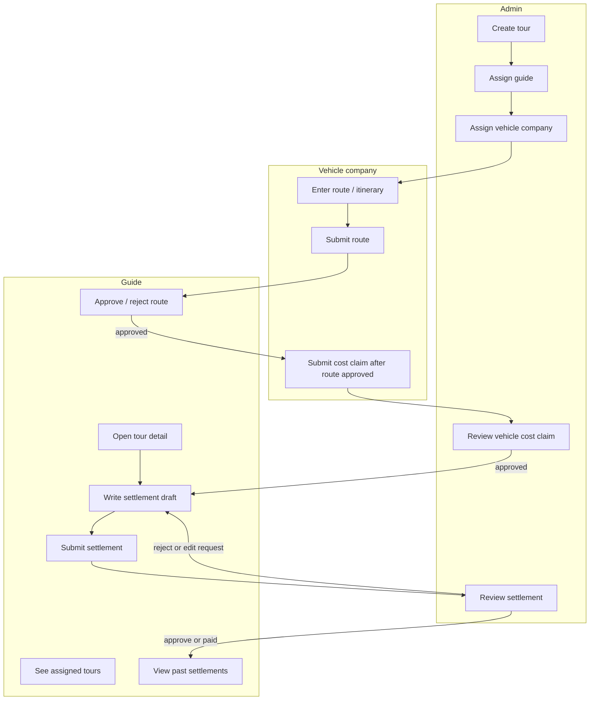
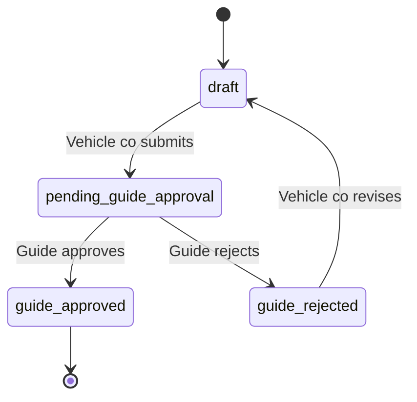
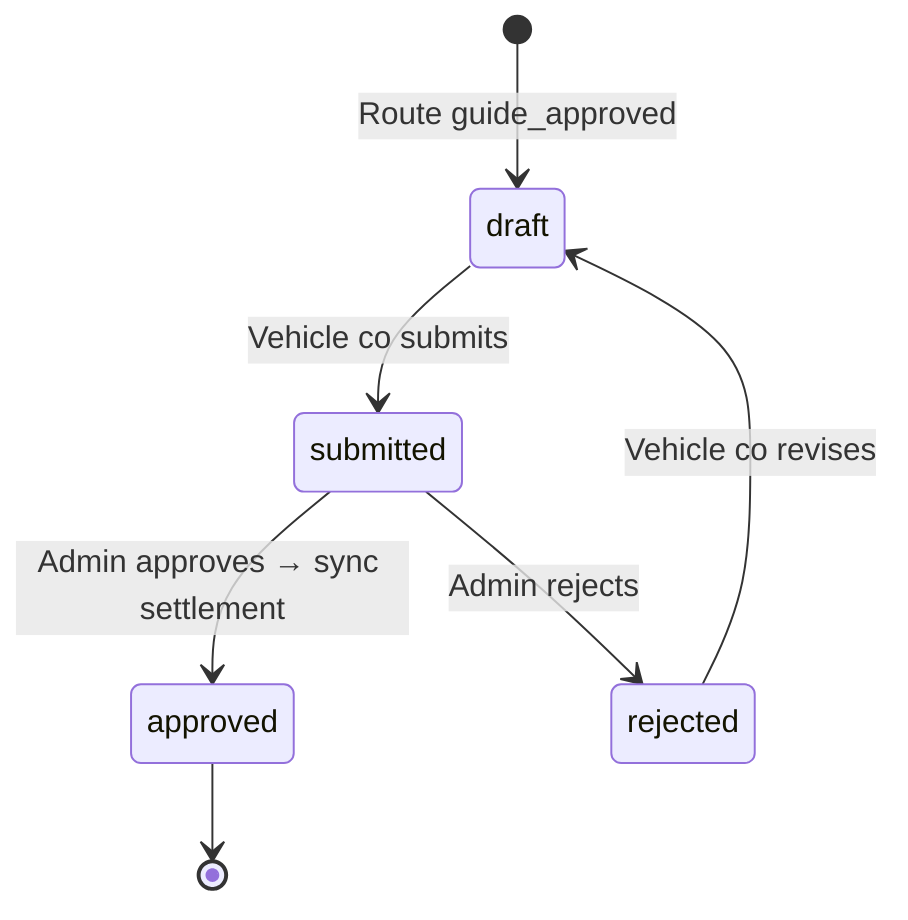
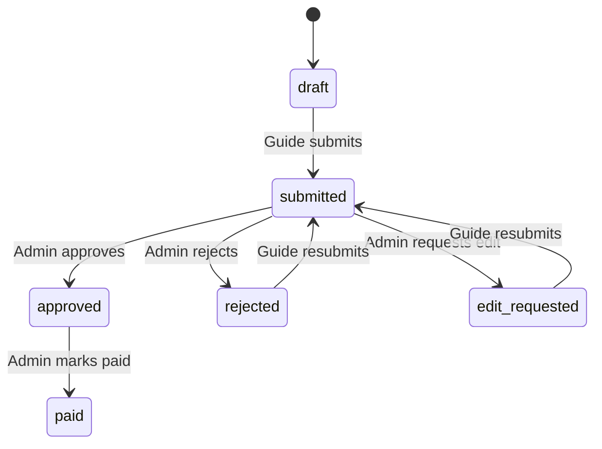

# Product workflow — guide-centric model

**Status:** Approved direction. **Do not implement** until Phase 1 stabilization exit criteria in [`ROADMAP.md`](ROADMAP.md) are met.

This document is the **single source of truth** for how guide, admin, and vehicle company users move through the system. It refocuses navigation from “pick any tour → write settlement” to **assigned tour → route review → settlement**.

---

## Core guide journey (13 steps)

| Step | Action | Who | Outcome |
|------|--------|-----|---------|
| 1 | Log in | Guide | Lands on guide home |
| 2 | See assigned tours only | Guide | No unassigned tours visible |
| 3 | Open assigned tour detail | Guide | Tour hub: route status, settlement status, next actions |
| 4 | Check vehicle company route / itinerary | Guide | Read-only route view |
| 5 | Approve or reject vehicle route | Guide | Route locked after approval; claim unlocked for vehicle co |
| 6 | After tour operation, write settlement | Guide | Settlement tied to that tour only |
| 7 | Save draft while editable | Guide | Partial save allowed |
| 8 | Submit final settlement | Guide | Status → `submitted` |
| 9 | After submission | Guide | Read-only until admin acts |
| 10 | Admin reviews | Admin/staff | Approve / reject / request edit |
| 11 | Rejected or edit requested | Guide | Can edit and resubmit (`rejected` = admin reject; `edit_requested` = admin grants edit) |
| 12 | Approved or paid | Guide | View only |
| 13 | Past tour settlements | Guide | Always viewable; edit only when admin grants |

### Business rules (non-negotiable)

| Rule | Enforcement layer |
|------|-------------------|
| No settlement for unassigned tours | Server + RLS + UI (tour not listed) |
| No edit after submit/approve/paid | `GUIDE_EDITABLE` + server actions + RLS |
| No manual edit of admin-approved vehicle cost fields | `vehicle_cost_locked` + read-only UI fields |
| Guide approves **route only**, not cost claim | Separate tables + permissions |
| Vehicle cost claim reviewed by **admin** | `/admin/vehicle-claims` |
| Past settlements read-only unless admin grants edit | `rejected` / `edit_requested` only |

**Settlement calculation:** `calc.ts` unchanged. Vehicle-approved costs sync into existing O79 / S75 fields only.

### Quick reference — 13 steps → screens

| Step | Guide action | Screen (target) |
|------|--------------|-----------------|
| 1 | Log in | `/login` → `/guide` |
| 2 | See assigned tours only | `/guide/tours` |
| 3 | Open tour detail | `/guide/tours/[tourId]` |
| 4 | Check vehicle route | `/guide/tours/[tourId]/vehicle-route` (read) |
| 5 | Approve / reject route | Same screen (write: status only) |
| 6 | Write settlement | `/guide/tours/[tourId]/settlement` |
| 7 | Save draft | Same (status stays `draft`) |
| 8 | Submit settlement | Tour settlement or `/guide/settlements/[id]` |
| 9 | Locked after submit | `/guide/settlements/[id]` — no edit link |
| 10 | *(Admin)* review | `/admin/settlements/[id]` |
| 11 | Edit again after reject / edit request | `/guide/settlements/[id]/edit` |
| 12 | View only after approve / paid | `/guide/settlements/[id]` — read-only |
| 13 | View past settlements anytime | `/guide/settlements` + detail |

### Current app vs target (gap today)

| Area | Today | Target |
|------|-------|--------|
| Tour entry | `/guide/settlements/new` — tour dropdown | Tour hub from assigned list only |
| Assignment | `tours.guide_id` filter (no admin UI) | `tour_guide_assignments` + admin assign |
| Vehicle route | Not implemented | Steps 4–5 before/during settlement |
| Edit rules | `GUIDE_EDITABLE` already correct | + assignment + locked vehicle fields |
| Save guard | Tour existence only on save | + assignment check + locked field reject |

---

## End-to-end flow diagram



---

## 1. Required guide screens

Navigation shifts from **settlement-first** to **tour-first**. Settlements remain accessible as history and detail views.

### Primary screens (new / refocused)

| Route | Screen | Purpose |
|-------|--------|---------|
| `/guide` | **Home** | Summary cards + shortcuts to assigned tours needing action |
| `/guide/tours` | **My assigned tours** | Only tours where `tour_guide_assignments.guide_id = me` |
| `/guide/tours/[tourId]` | **Tour detail hub** | Central screen: tour info, vehicle route status, settlement status, CTAs |
| `/guide/tours/[tourId]/vehicle-route` | **Vehicle route review** | Read itinerary; approve / reject with optional note |
| `/guide/tours/[tourId]/settlement` | **Settlement workspace** | Create or edit settlement for this tour (replaces generic `/new` entry) |
| `/guide/settlements` | **Settlement history** | All past settlements (read-only list with status badges) |
| `/guide/settlements/[id]` | **Settlement detail** | View summary; edit link only if editable |

### Tour detail hub — recommended sections

```
┌─────────────────────────────────────┐
│ Tour: DN-2025-1101 · 다낭 3박4일      │
├─────────────────────────────────────┤
│ 🚌 Vehicle route: [승인 대기]         │
│    [경로 확인 · 승인/반려]             │
├─────────────────────────────────────┤
│ 📋 Settlement: [작성중] / [없음]       │
│    [정산 작성] or [정산 계속]          │
├─────────────────────────────────────┤
│ ℹ️ Vehicle cost: [관리자 검토중]      │  ← read-only for guide
│    (승인된 금액은 정산 O79/S75 반영)    │
└─────────────────────────────────────┘
```

### Actions by tour state

| Tour state | Guide sees | Primary CTA |
|------------|------------|-------------|
| Route pending guide | Badge “경로 승인 필요” | 승인 / 반려 |
| Route rejected (by guide) | “차량회사 수정 중” | — |
| Route approved, no settlement | “정산 작성 가능” | 정산 작성 |
| Settlement draft | “작성 중” | 계속 작성 |
| Settlement submitted | “검토 중” | 상세 보기 |
| Settlement rejected / edit requested | “수정 필요” | 수정하기 |
| Settlement approved / paid | “완료” | 상세 보기 (읽기 전용) |

### Screens to de-emphasize or redirect

| Current route | Target behavior |
|---------------|-----------------|
| `/guide/settlements/new` | Redirect to `/guide/tours` or require `?tourId=` from assignment |
| `/guide/settlements/preview` | Dev/demo only; not part of production guide flow |

---

## 2. Required admin screens

### Tour & assignment management

| Route | Screen | Purpose |
|-------|--------|---------|
| `/admin/tours` | **Tour list** | Filter by month, branch, assignment status |
| `/admin/tours/new` | **Create tour** | Tour metadata (no guide required at create) |
| `/admin/tours/[id]` | **Tour detail** | Edit tour + **assign guides** + **assign vehicle companies** |

### Settlement review (exists — extend)

| Route | Screen | Purpose |
|-------|--------|---------|
| `/admin` | **Dashboard** | Counts: pending settlements, pending vehicle claims |
| `/admin/settlements` | **Settlement queue** | Filter by status (existing) |
| `/admin/settlements/[id]` | **Settlement review** | Approve / reject / request edit / mark paid (existing `ReviewPanel`) |

### Vehicle cost claim review (new)

| Route | Screen | Purpose |
|-------|--------|---------|
| `/admin/vehicle-claims` | **Claim queue** | `status = submitted` |
| `/admin/vehicle-claims/[id]` | **Claim detail** | Route summary + cost breakdown + approve / reject |

### Optional admin screens (post-MVP)

| Route | Purpose |
|-------|---------|
| `/admin/guides` | Manage guide accounts |
| `/admin/vehicle-companies` | Manage vehicle company accounts |

---

## 3. Required vehicle company screens

Separate app area: `/vehicle/*` with `requireVehicleCompany()` layout guard.

| Route | Screen | Purpose |
|-------|--------|---------|
| `/vehicle` | **Home** | Assigned tours needing route or claim action |
| `/vehicle/tours` | **Assigned tours** | Tours from `tour_vehicle_assignments` |
| `/vehicle/tours/[tourId]` | **Tour detail** | Route status, claim status, next step |
| `/vehicle/tours/[tourId]/route` | **Route editor** | Itinerary JSON form / day-by-day UI |
| `/vehicle/tours/[tourId]/route/submit` | *(action)* | Submit route → `pending_guide_approval` |
| `/vehicle/tours/[tourId]/claim` | **Cost claim** | Enabled only when route `guide_approved` |
| `/vehicle/claims/[id]` | **Claim detail** | View admin decision / rejection reason |

**Vehicle company cannot:** view guide settlement form, approve own claim, edit route after guide approval (MVP: revision only after guide rejection).

---

## 4. Permission rules

### Role capabilities matrix

| Action | Guide | Vehicle co | Admin | Staff |
|--------|:-----:|:----------:|:-----:|:-----:|
| View assigned tours (own) | ✅ | ✅ | ✅ all | ✅ all |
| Create tour | ❌ | ❌ | ✅ | ✅ |
| Assign guide / vehicle co | ❌ | ❌ | ✅ | ✅ |
| Edit vehicle route | ❌ | ✅ own | ❌ | ❌ |
| Submit vehicle route | ❌ | ✅ | ❌ | ❌ |
| Approve/reject vehicle **route** | ✅ assigned | ❌ | ❌ | ❌ |
| Submit vehicle **cost claim** | ❌ | ✅ after route approved | ❌ | ❌ |
| Approve/reject vehicle **claim** | ❌ | ❌ | ✅ | ✅ |
| Create settlement | ✅ assigned tour | ❌ | ❌ | ❌ |
| Save settlement draft | ✅ editable status | ❌ | ❌ | ❌ |
| Submit settlement | ✅ editable status | ❌ | ❌ | ❌ |
| Edit locked vehicle cost fields (O79, extra vehicle) | ❌ when locked | ❌ | ❌ | ❌ |
| Review settlement | ❌ | ❌ | ✅ | ✅ |
| View own past settlements | ✅ | ❌ | ✅ | ✅ |
| Upload guide receipts | ✅ editable settlement | ❌ | ❌ | view all |

### Server-side guards (required on every write)

```
assertGuideAssigned(tourId, guideId)
assertSettlementEditable(settlementId, guideId)   // draft | rejected | edit_requested
assertVehicleRouteApprovable(routeId, guideId)
assertVehicleClaimSubmittable(routeId, companyId) // route = guide_approved
assertVehicleCostNotLocked(settlementId)          // when patching O79 / extra vehicle
```

### RLS principles

- Guides: `SELECT tours` only via `tour_guide_assignments`
- Vehicle co: `SELECT tours` only via `tour_vehicle_assignments`
- Settlements INSERT: guide assigned to tour + `guide_id = auth.uid()`
- Vehicle routes UPDATE (approve): assigned guide only, status transition only
- Vehicle claims UPDATE (approve): admin/staff only

---

## 5. Status transitions

Three independent state machines. They interact but must not be merged into one status field.

### A. Vehicle route (`vehicle_routes.status`)



| Status | Guide | Vehicle co | Admin |
|--------|-------|------------|-------|
| `draft` | — | Edit route | View |
| `pending_guide_approval` | Approve / reject | View only | View |
| `guide_approved` | View | Submit claim | View |
| `guide_rejected` | View reason | Edit + resubmit | View |

### B. Vehicle cost claim (`vehicle_claims.status`)



**Gate:** claim cannot leave `draft` unless linked route is `guide_approved`.

**On `approved`:** sync to settlement (see §6) + set `vehicle_cost_locked = true`.

### C. Settlement (`settlements.status`) — existing, aligned with business rules



| Status | Guide can edit? | Guide can submit? |
|--------|:---------------:|:-----------------:|
| `draft` | ✅ | ✅ |
| `submitted` | ❌ | ❌ |
| `approved` | ❌ | ❌ |
| `paid` | ❌ | ❌ |
| `rejected` | ✅ | ✅ |
| `edit_requested` | ✅ | ✅ |

**Already implemented:** `GUIDE_EDITABLE = ['draft', 'rejected', 'edit_requested']` in `src/types/index.ts`.

### Cross-object timing (operational)

| Phase | Typical order |
|-------|----------------|
| Before tour | Admin assigns guide + vehicle co |
| Before / during tour | Vehicle co drafts route |
| After operation starts | Guide approves route |
| After operation | Vehicle co submits claim; guide may start settlement draft in parallel |
| Before guide submit | Admin-approved vehicle costs appear locked in settlement (recommended) |
| After guide submit | Admin reviews settlement |

**MVP recommendation:** warn guide if vehicle claim not yet approved; do **not** block settlement submit in Phase 1 stabilization. **Block or warn** can be a configurable rule in Phase 3.

---

## 6. Minimal DB changes

All changes are **additive**. No changes to `calc.ts` or settlement item table shapes.

### Phase 2 — Tour assignment (prerequisite for guide refocus)

```sql
CREATE TABLE tour_guide_assignments (
  id          uuid PRIMARY KEY DEFAULT gen_random_uuid(),
  tour_id     uuid NOT NULL REFERENCES tours(id) ON DELETE CASCADE,
  guide_id    uuid NOT NULL REFERENCES profiles(id) ON DELETE CASCADE,
  assigned_by uuid REFERENCES profiles(id),
  assigned_at timestamptz NOT NULL DEFAULT now(),
  UNIQUE (tour_id, guide_id)
);

-- Backfill from legacy column
INSERT INTO tour_guide_assignments (tour_id, guide_id, assigned_by)
SELECT id, guide_id, created_by FROM tours WHERE guide_id IS NOT NULL
ON CONFLICT DO NOTHING;
```

Optional: `tours.guide_id` kept nullable for new tours; no longer authoritative.

### Phase 3 — Vehicle workflow + settlement link

```sql
-- Role
ALTER TYPE user_role ADD VALUE IF NOT EXISTS 'vehicle_company';

CREATE TABLE vehicle_companies (
  id uuid PRIMARY KEY DEFAULT gen_random_uuid(),
  name text NOT NULL,
  branch_id uuid REFERENCES branches(id),
  is_active boolean NOT NULL DEFAULT true,
  created_at timestamptz NOT NULL DEFAULT now()
);

ALTER TABLE profiles
  ADD COLUMN vehicle_company_id uuid REFERENCES vehicle_companies(id);

CREATE TABLE tour_vehicle_assignments (
  id uuid PRIMARY KEY DEFAULT gen_random_uuid(),
  tour_id uuid NOT NULL REFERENCES tours(id) ON DELETE CASCADE,
  vehicle_company_id uuid NOT NULL REFERENCES vehicle_companies(id),
  assigned_by uuid REFERENCES profiles(id),
  assigned_at timestamptz NOT NULL DEFAULT now(),
  UNIQUE (tour_id, vehicle_company_id)
);

CREATE TYPE vehicle_route_status AS ENUM (
  'draft', 'pending_guide_approval', 'guide_approved', 'guide_rejected'
);

CREATE TABLE vehicle_routes (
  id uuid PRIMARY KEY DEFAULT gen_random_uuid(),
  tour_id uuid NOT NULL REFERENCES tours(id) ON DELETE CASCADE,
  vehicle_company_id uuid NOT NULL REFERENCES vehicle_companies(id),
  created_by uuid NOT NULL REFERENCES profiles(id),
  status vehicle_route_status NOT NULL DEFAULT 'draft',
  itinerary_json jsonb NOT NULL DEFAULT '[]',
  guide_note text,
  guide_approved_by uuid REFERENCES profiles(id),
  guide_approved_at timestamptz,
  guide_rejected_reason text,
  submitted_at timestamptz,
  created_at timestamptz NOT NULL DEFAULT now(),
  updated_at timestamptz NOT NULL DEFAULT now(),
  UNIQUE (tour_id, vehicle_company_id)
);

CREATE TYPE vehicle_claim_status AS ENUM (
  'draft', 'submitted', 'approved', 'rejected'
);

CREATE TABLE vehicle_claims (
  id uuid PRIMARY KEY DEFAULT gen_random_uuid(),
  tour_id uuid NOT NULL REFERENCES tours(id),
  vehicle_route_id uuid NOT NULL REFERENCES vehicle_routes(id),
  vehicle_company_id uuid NOT NULL REFERENCES vehicle_companies(id),
  created_by uuid NOT NULL REFERENCES profiles(id),
  status vehicle_claim_status NOT NULL DEFAULT 'draft',
  base_cost_usd numeric(12,2) NOT NULL DEFAULT 0,
  base_cost_vnd bigint NOT NULL DEFAULT 0,
  extra_cost_usd numeric(12,2) NOT NULL DEFAULT 0,
  extra_cost_vnd bigint NOT NULL DEFAULT 0,
  description text,
  reject_reason text,
  reviewed_by uuid REFERENCES profiles(id),
  reviewed_at timestamptz,
  settlement_id uuid REFERENCES settlements(id),
  synced_at timestamptz,
  submitted_at timestamptz,
  created_at timestamptz NOT NULL DEFAULT now(),
  UNIQUE (vehicle_route_id)
);

ALTER TABLE settlements
  ADD COLUMN vehicle_route_id uuid REFERENCES vehicle_routes(id),
  ADD COLUMN vehicle_claim_id uuid REFERENCES vehicle_claims(id),
  ADD COLUMN vehicle_cost_locked boolean NOT NULL DEFAULT false;
```

### Settlement sync mapping (no schema change to calc inputs)

| Source | Target column | Excel |
|--------|---------------|-------|
| `vehicle_claims.base_cost_usd` | `settlements.vehicle_fee_usd` | O79 |
| `vehicle_claims.extra_*` | `option_items` (`is_extra_vehicle=true`) | S75 |

---

## 7. Current pages — required changes

**Legend:** 🟢 keep · 🟡 modify · 🔴 replace/redirect · 🆕 new

### Guide app

| Current page | Change | Notes |
|--------------|--------|-------|
| `/guide` 🟡 | Refocus home | Show “assigned tours needing action”; de-emphasize global “새 정산서” |
| `/guide/settlements` 🟢 | Keep as history | Add link to tour hub when settlement exists |
| `/guide/settlements/new` 🔴 | Redirect | → `/guide/tours` or `/guide/tours/[id]/settlement` with assignment guard |
| `/guide/settlements/[id]` 🟡 | Extend | Show vehicle claim sync status; hide edit when not editable |
| `/guide/settlements/[id]/edit` 🟡 | Extend | Lock O79 + extra vehicle when `vehicle_cost_locked`; assignment check |
| `/guide/settlements/preview` 🟢 | Dev only | Exclude from production guide nav |
| `/guide/tours` 🆕 | New | Assigned tours list |
| `/guide/tours/[id]` 🆕 | New | Tour detail hub |
| `/guide/tours/[id]/vehicle-route` 🆕 | New | Route approve/reject |
| `/guide/tours/[id]/settlement` 🆕 | New | Tour-scoped settlement form (may wrap existing `SettlementForm`) |
| `guide/layout.tsx` 🟡 | Nav tabs | **투어** · **정산내역** (instead of settlement-first) |

### Admin app

| Current page | Change | Notes |
|--------------|--------|-------|
| `/admin` 🟡 | Dashboard | Add pending vehicle claims + tour management links |
| `/admin/settlements` 🟢 | Keep | — |
| `/admin/settlements/[id]` 🟡 | Extend | Show linked vehicle claim amounts (read-only context) |
| `/admin/tours` 🆕 | New | CRUD + assignments |
| `/admin/tours/[id]` 🆕 | New | Guide + vehicle company assignment UI |
| `/admin/vehicle-claims` 🆕 | New | Claim review queue |
| `/admin/vehicle-claims/[id]` 🆕 | New | Approve/reject + trigger settlement sync |

### Vehicle company app

| Current page | Change |
|--------------|--------|
| *(none)* | 🆕 Entire `/vehicle/*` tree (see §3) |
| `app/page.tsx` 🟡 | Redirect `vehicle_company` → `/vehicle` |
| `session.ts` 🟡 | Add `requireVehicleCompany()` |

### Shared / server

| Module | Change |
|--------|--------|
| `settlementActions.ts` 🟡 | `getAvailableTours()` → assignment join; `upsertSettlement()` → assert assignment |
| `settlementActions.ts` 🟡 | Reject writes to locked vehicle fields |
| `settlementFormStore.ts` 🟡 | Read-only flags for locked vehicle fields |
| `TCSettlementSection.tsx` 🟡 | Disable O79 when locked |
| `LineItemSections.tsx` 🟡 | Disable extra vehicle row when locked |
| `types/index.ts` 🟡 | Add `vehicle_company` role; optional settlement link fields |
| New `tourActions.ts` 🆕 | Tour CRUD, assignments |
| New `vehicleRouteActions.ts` 🆕 | Route CRUD, guide approve |
| New `vehicleClaimActions.ts` 🆕 | Claim CRUD, admin approve, settlement sync |

**Unchanged:** `calc.ts`, Excel section definitions, receipt upload flow structure, admin `reviewSettlement` status transitions.

---

## Implementation phasing (aligned with ROADMAP)

| Phase | Scope | Guide workflow impact |
|-------|-------|----------------------|
| **Phase 1 (now)** | Stabilize existing settlement pages | Current `/guide/settlements/*` — no tour hub yet |
| **Phase 2** | Tour assignment DB + admin tours + guide tour list | Steps 1–3; settlement still from tour detail CTA |
| **Phase 3** | Vehicle routes, claims, sync, locked fields | Steps 4–5 + vehicle cost rules |
| **Phase 4** | Navigation polish | Full tour hub UX; deprecate orphan `/new` |

---

## Related documents

| Document | Role |
|----------|------|
| [`ROADMAP.md`](ROADMAP.md) | Phase priorities and exit criteria |
| [`GUIDE_TESTING_GUIDE.md`](GUIDE_TESTING_GUIDE.md) | Phase 1 settlement E2E test (update after Phase 2) |
| [`DB_WORKFLOW_CHECKLIST.md`](DB_WORKFLOW_CHECKLIST.md) | Phase 1 DB verification |

---

## Open items (confirm before Phase 2 coding)

1. **Settlement before vehicle claim approved:** warn only, or block submit? (Recommend: warn in MVP, block optional later.)
2. **One settlement per guide per tour:** keep current uniqueness? (Recommend: **yes**.)
3. **Guide home default tab:** tours vs settlements history? (Recommend: **assigned tours**.)
4. **Co-guides on one tour:** multiple assignments, each with own settlement? (Recommend: **yes**, schema supports it.)
