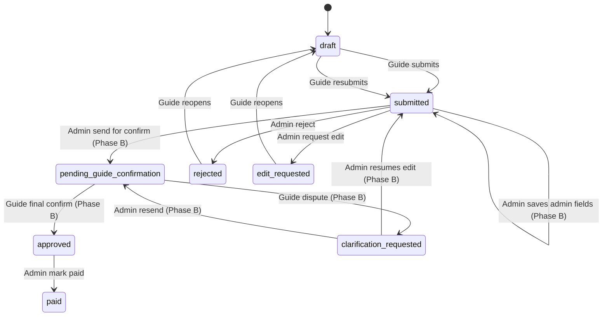

# Settlement confirmation workflow

Backend-first rollout for **guide final confirmation** after admin review.  
Excel template and `src/lib/settlement/calc.ts` remain the calculation source of truth.

---

## Status semantics

| Status | Korean label | Meaning |
|--------|--------------|---------|
| `draft` | 작성중 | Guide editing |
| `submitted` | 제출됨 | Guide locked; admin may edit admin-owned fields |
| `pending_guide_confirmation` | 최종확인 대기 | Admin sent back; guide confirm or clarify only |
| `clarification_requested` | 확인 이의 | Guide disputed admin changes |
| `approved` | 최종확인 완료 | **Guide** final confirmed (locked, payable) |
| `paid` | 지급완료 | Admin marked paid |
| `rejected` | 반려됨 | Admin rejected before confirmation path |
| `edit_requested` | 수정요청 | Admin sent back for guide content re-edit |

### Rules

- **`submitted`** = guide submitted; admin can edit (Phase B) but not direct-approve.
- **`pending_guide_confirmation`** = admin reviewed and sent for guide final sign-off.
- **`approved`** = guide final confirmed — **not** admin direct approve.
- **`paid`** = admin paid — only after guide confirmation in the new flow.
- Guide cannot edit after `submitted` (except via `rejected` / `edit_requested`).
- Admin cannot mark `paid` before guide final confirmation when a submit snapshot exists.
- **`rejected` / `edit_requested`** remain for guide re-edit before confirmation.
- **`clarification_requested`** = guide disputes admin numeric changes without full resubmit.

---

## State flow

---

## Phase plan

| Phase | Scope | App impact |
|-------|-------|------------|
| **A (this)** | DB migration, types, status constants, server guards | No confirmation UI; admin direct approve blocked |
| **B** | Snapshots on submit, admin save, send for confirmation | New server actions; minimal admin UX |
| **C** | Guide `/confirm` page with diff highlights | Read-only confirm + clarify |
| **D** | Pay guard for all new rows; docs/tests update | Behavior change for new settlements only |

---

## Database (Phase A)

Migration file: [`supabase/settlement_confirmation_migration.sql`](../supabase/settlement_confirmation_migration.sql)

### New tables

| Table | Purpose |
|-------|---------|
| `settlement_snapshots` | Immutable JSON at milestones (`guide_submit`, `admin_pre_confirm`, `guide_confirmed`) |
| `settlement_audit_events` | Append-only who/when/action log |
| `settlement_field_changes` | Per-field before/after for audit and red UI |
| `settlement_confirmations` | Frozen diff bundle each time admin sends guide the review packet |

### New columns on `settlements` (all nullable)

| Column | Purpose |
|--------|---------|
| `sent_for_confirmation_at` / `sent_for_confirmation_by` | Admin sent for guide confirm |
| `guide_confirmed_at` / `guide_confirmed_by` | Guide final confirmation |
| `clarification_requested_at` / `clarification_message` | Guide dispute |
| `active_confirmation_id` | Pointer to current confirmation packet |
| `guide_submit_snapshot_id` | Baseline snapshot at guide submit |

---

## Code (Phase A)

| File | Role |
|------|------|
| `src/lib/settlement/status-guards.ts` | Status constants + `can*` / `assertAdminReviewAction` |
| `src/types/index.ts` | Extended types, `STATUS_META`, re-exports guards |
| `src/lib/actions/settlementActions.ts` | `reviewSettlement` uses guards (blocks direct approve) |

### Legacy rows

Existing `approved` settlements **without** `guide_submit_snapshot_id` remain payable.  
New workflow rows will require `guide_confirmed_at` before pay once snapshots are written (Phase B+).

---

## What is NOT in Phase A

- Guide confirmation UI (`/guide/settlements/[id]/confirm`)
- Admin edit form / send-for-confirmation action
- Snapshot creation on submit
- Diff generation or red field highlights
- Changes to `calc.ts`

---

## Related docs

- [`PRODUCT_WORKFLOW.md`](./PRODUCT_WORKFLOW.md) — overall product flow
- [`PHASE1_TEST_SCENARIO.md`](./PHASE1_TEST_SCENARIO.md) — current E2E tests (pre-confirmation)
